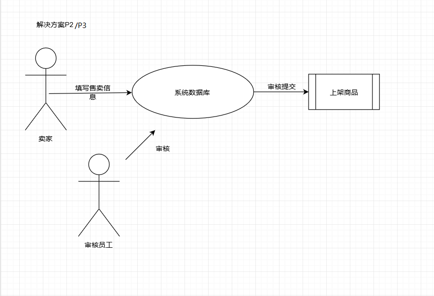
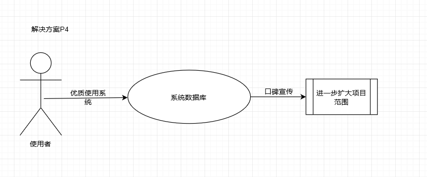
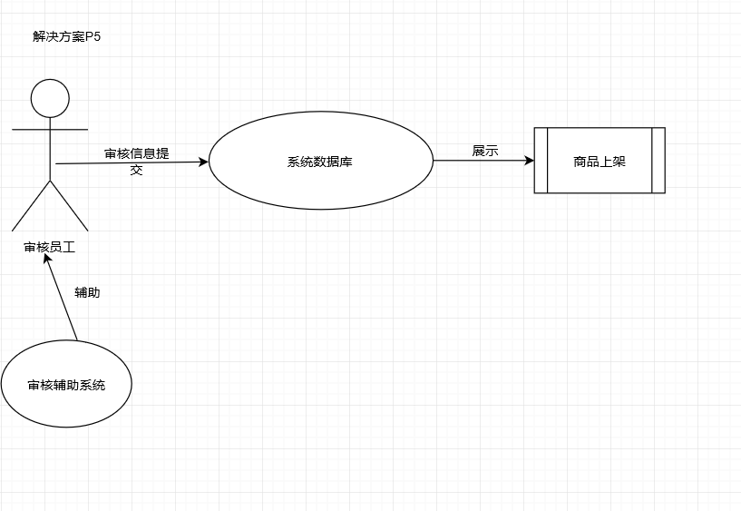

<h1>
校园二手交易平台 过程分析文档
</h1>

<b>SEF4非法集会</b> 161250097 庞博 161250018 仇盛 161250098 彭俊杰 161250099 戚城武

## 1.明确问题 

### 1.1 初步了解问题 

校园二手交易平台是南京大学的一个自主交易平台，自创建以来，平台利润却甚是单薄。平台聘请了多名平台管理员，有发布商品信息员、问题反馈接线员，由于用户订单杂乱，而且对于用户的订单时间、地址等信息都无法很好的进行分类，配送人员的任务繁重。另外，平台在经营管理方面一直存在诸多问题。比如：时常有卖家以次充好，商品质量与描述不符，导致平台收到了多起投诉反馈电话，而平台对违规发布者的处理并不及时，导致用户量流失；对于非当面交易，买家与代送者之间的交接由于没有统一的时间和地点，经常出现接收错误、接收等待时间过长等问题；买家卖家之间的即时通信由于信息提示不够明显，导致用户体验感下降；用户有时无法通过外网接入教务网进行身份验证登陆平台；商品分类不够明晰，搜索推送使用到的相关词条无法指向准确的商品；商品审核不够及时，偶尔会出现某些商品多日未进行审核的问题。

我们小组通过开会讨论，从中提取出了几个客户希望表达的问题和我们开发人员的疑问并记录下来，然后与用户展开了第一次面谈，面谈报告如下：

| 日期:2018 年 9 月 30 日                                                                                                主题:关于校园二手交易平台业务流程和面临问题初步了解                                                          会见者:彭俊杰      被会见者:钱先生                                                                                                                  会见目标:                                                                                                                             初步了解平台的业务流程                                                                                                 获得平台的经营状况和规模                                                                                                                   了解平台现阶段面临的问题                                                                                             了解用户的一些希望和目标 |                                                              |
| ------------------------------------------------------------ | ------------------------------------------------------------ |
| 谈话要点：                                                                                                                        简要说明下平台的业务流程                                                                                               现在平台的用户流量具体情况                                                                                         平台现阶段面临的一些困境                                                                                             对未来发展的希望和一些措施                                                                                         对新系统的一些看法和期望 | 被会见者的观点：                     管理不够精细，问题频发，效率低下；用户流失，主要由于客服没有保障以及用户体验不够完美 ；平台服务质量总体上比较粗糙；迫切需要一些系统功能来改进体验                                              ；对未来抱着很大的发展期望 |
| 下次会见的目标:                                                                                                对此次面谈中不明确的部分进一步面谈和了解                                               对提出的解决方案进行协商评估                                                                       找出下一个被会见者的观点 |                                                              |

 通过这次面谈我们了解到了平台的一些情况:

a. 目前状况

1. 平台共有21位职工，3名负责配送分配，4名负责问题反馈接收，2名负责商品审核，4名负责商品分类，6名负责商品配送，2名会计

2. 业务流程：用户网上下单---->配送分配员分配订单---->一名会计负责归类---->

商品配送送货---->顾客签字确认---->另一位会计手动每日账单汇总；

3. 目前部分顾客流失，但是原因不清晰，怀疑可能性如下： 商品检索推荐功能不完善、接线员处理问题不及时、宣传不够力度、没有足够的反馈等；

4. 买家卖家之间的即时通信信息提示不够明显；

5. 用户有时无法通过外网接入教务网进行身份验证登陆平台；

6. 平台对以次充好（盗版商品充当二手商品）的违规发布者的处理并不及时；

7. 宣传手段单一，仅仅通过发传单；

8. 对于供应方和购买方缺少统一的交接时间和地点；

b. 客户希望实现的功能

1. 开辟多种支付渠道，不仅仅是现金支付，如银行卡支付，微信支付，支付宝支付；

2. 账单自动结算，总消费自动记录并可查看；

3. 多次购买后能有相应的喜好推荐；

4. 用户能个性化设置商品推荐；

5. 使用时间长的老用户可以享有打折优惠，送货上门服务；

c. 总的概述

当前，在送货这一部分业务中存在一些主要问题，经营管理也存在一些问题，职工任务繁重，订单信息没有很好管理，供货方也存在问题。

### 1.2 问题达成共识 

面谈之后，我们提炼了个主要的高层次问题，采用如下标准化的格式进行描述，

并在涉众之间取得了认同。

| 要素   | 内容                                                 |
| ------ | ---------------------------------------------------- |
| ID     | P1                                                   |
| 提出者 | 平台运营者                                           |
| 关联者 | 反馈接收人员、商品分类人员                           |
| 问题   | 缺乏用户资料信息，导致不能针对用户制定个性化商品推荐 |
| 影响   | 无法根据用户爱好推荐信息，用户体验感下降             |

| 要素   | 内容                                               |
| ------ | -------------------------------------------------- |
| ID     | P2                                                 |
| 提出者 | 反馈接收人员                                       |
| 关联者 | 反馈接收人员、平台运营者、商品审核人员             |
| 问题   | 买家无法确定商品的质量，平台需要对商品进行质量评估 |
| 影响   | 导致买家上当购买瑕疵商品，对平台的信任值下降       |

| 要素   | 内容                                           |
| ------ | ---------------------------------------------- |
| ID     | P3                                             |
| 提出者 | 平台运营者                                     |
| 关联者 | 平台运营者、反馈接收人员、卖家                 |
| 问题   | 缺少商品统一交付地点，买家卖家因此常常出现矛盾 |
| 影响   | 买家卖家的商品买卖体验感下降，导致用户量流失   |

| 要素   | 内容                           |
| ------ | ------------------------------ |
| ID     | P4                             |
| 提出者 | 平台运营者                     |
| 关联者 | 平台运营者、卖家               |
| 问题   | 供应二手商品的用户数量不足     |
| 影响   | 商品种类数量匮乏，无法吸引用户 |

| 要素   | 内容                                             |
| ------ | ------------------------------------------------ |
| ID     | P5                                               |
| 提出者 | 平台运营者                                       |
| 关联者 | 平台运营者、反馈接收人员、审核人员、配送员       |
| 问题   | 商品审核不够及时，经常出现拖延审核               |
| 影响   | 商品发布者体验感很差，导致发布商品的用户数量流失 |

**收集背景资料，判断问题的明确性** 

​    我们通过收集有关平台经营的背景资料，结合用户提出的问题，分析和理解问题域，对上述五个问题的明确性做出了初步判断，认为只有第四个问题比较模糊，是不明确的。而其他四个问题都是明确一致的问题。

**分析不明确的问题，发现问题背后的问题** 

  通过进一步收集相关的资料和业务数据，以及与涉众进行接触，我们发现导致愿意合作的供货商不多的可能的原因有多个，我们制作了 P4 原因的鱼骨图如下

<h2>2.涉众分析 </h2>
### 2.1 涉众识别和描述 

在明确问题的同时，我们同步进行了涉众分析。通过涉众识别，我们得到了以下涉众扩展特征描述表： 

| 涉众                   | 特征                                          | 主要目标                                        | 态度                               | 主要关注点                                                   | 约束条件                                                     |
| ---------------------- | --------------------------------------------- | ----------------------------------------------- | ---------------------------------- | ------------------------------------------------------------ | ------------------------------------------------------------ |
| 平台运营者             | 具有解雇职员，调整职务的权力                  | 增加运营利润，扩大经营范围                      | 强烈支持                           | 使用该系统所节约的费用必须超过开发和维护此系统的费用，并且能够提高平台的影响度 | 可能没有足够多懂得使用软件系统的人员                         |
| 反馈接收人员（接线员） | 接听电话，能够清楚的了解用户反馈问题          | 能够快速为用户解决方案，提高用户满意度          | 支持，但是担心自己的计算机技能不够 | 为顾客提供满意的服务，将反馈及时录入系统                     | 可能没有相关的计算机技能                                     |
| 商品审核人员（监管者） | 审核商品，能够快速分辨商品是否合格            | 能够迅速完成商品审核使之上架，减少商品审核耗时  | 支持，但是担心自己的计算机技能不够 | 及时将合格商品上架，撤回不合格商品                           | 可能没有相关的计算机技能                                     |
| 商品分类人员           | 能够快速将商品进行分类                        | 让商品分门别类，为买家提供便利                  | 非常担心 裁员问 题，故强 烈反对    | 保证工作                                                     | 没有相关的计算机技能                                         |
| 商品配送人员           | 能够使用交通工具进行商品的配送                | 能够准确高效的配送路线， 并且配送商品时不带零钱 | 强烈支持                           | 运送方便，快捷                                               | 无                                                           |
| 记账会计               | 具有较强的计算账单能力， 并且对营业额非常敏感 | 提高统计账单的效率以及准确率                    | 担心裁员 问题，否 则很乐意 接受    | 保证工作                                                     | 没有相关的计算机技能                                         |
| 买家                   | 无                                            | 可以更好地选择二手商品，节约时间，更加方便      | 强烈支持                           | 送货可靠，商品选择有效                                       | 需要利用教务网的接口注册账号，账号信息和教务网同步，只允许本校交易 |
| 卖家                   | 无                                            | 可以更好地出售二手商品，节约时间，更加方便      | 强烈支持                           | 商品出售有保证                                               | 需要利用教务网的接口注册账号，账号信息和教务网同步，只允许本校交易 |
| 代送者（第三方）       | 能够进行商品配送                              | 可以提供代送服务，赚点外快                      | 强烈支持                           | 在空闲时间赚取外快                                           | 需要利用教务网的接口注册账号，账号信息和教务网同步，只允许本校交易 |

### 2.2 涉众评估 

为了得到更深层次的涉众信息，我们采用了优先级评估涉众的方法，做出了如下 User/Task 矩阵，用来评估涉众的优先级：

| 用户群体               | 任务                        | 群体数量 | 优先级 |
| ---------------------- | --------------------------- | -------- | ------ |
| 平台运营者             | 查看营业额                  | 1        | 3      |
| 反馈接收人员（接线员） | 记录反馈信息， 提供解决方案 | 2        | 2      |
| 商品审核人员（监管者） | 审核商品                    | 2        | 1      |

## 3.发现业务需求 

确定每一个问题对应得目标的过程就是发现业务需求的过程。因此，针对上述五个高层次问题，我们确定了对应的业务需求。将问题描述表扩展成以下的问题及业务需求

描述表：

| 要素   | 内容                                                 |
| ------ | ---------------------------------------------------- |
| ID     | P1                                                   |
| 提出者 | 平台运营者                                           |
| 关联者 | 反馈接收人员、商品分类人员                           |
| 问题   | 缺乏用户资料信息，导致不能针对用户制定个性化商品推荐 |
| 影响   | 无法根据用户爱好推荐信息，用户体验感下降             |
| 目标   | 在系统改进运行三个月后，使二次购买用户比率增加 20%   |

| 要素   | 内容                                               |
| ------ | -------------------------------------------------- |
| ID     | P2                                                 |
| 提出者 | 反馈接收人员                                       |
| 关联者 | 反馈接收人员、平台运营者、商品审核人员             |
| 问题   | 买家无法确定商品的质量，平台需要对商品进行质量评估 |
| 影响   | 导致买家上当购买瑕疵商品，对平台的信任值下降       |
| 目标   | 措施实施一个月后，商品瑕疵品比率控制在 5%以下      |

| 要素   | 内容                                           |
| ------ | ---------------------------------------------- |
| ID     | P3                                             |
| 提出者 | 平台运营者                                     |
| 关联者 | 平台运营者、反馈接收人员、卖家                 |
| 问题   | 缺少商品统一交付地点，买家卖家因此常常出现矛盾 |
| 影响   | 买家卖家的商品买卖体验感下降，导致用户量流失   |
| 目标   | 两个月后用户数量至少增加 30%                   |

| 要素   | 内容                           |
| ------ | ------------------------------ |
| ID     | P4                             |
| 提出者 | 商品分类人员                   |
| 关联者 | 平台运营者、卖家               |
| 问题   | 二手商品的供应数量不足         |
| 影响   | 商品种类数量匮乏，无法吸引用户 |
| 目标   | 一个月后商品种类和数量增加50%  |

| 要素   | 内容                                             |
| ------ | ------------------------------------------------ |
| ID     | P5                                               |
| 提出者 | 平台运营者                                       |
| 关联者 | 平台运营者、反馈接收人员、审核人员、配送员       |
| 问题   | 商品审核不够及时，经常出现拖延审核               |
| 影响   | 商品发布者体验感很差，导致发布商品的用户数量流失 |
| 目标   | 三个月后商品发布者数量至少增加 10%               |

## 4.定义解决方案和系统特性

### 4.1 确定高层次的解决方案

首先，我们对每一个明确一致的问题都尽可能发现各种可行的解决方案：

| 问题 | 解决方案                                                     |
| :--: | ------------------------------------------------------------ |
|  P1  | S1：通过分析顾客的电子账单和浏览信息，建立顾客信息数据库，对顾客进行分类 |
|  P2  | S1：对买家加入图片预览和详细描述的要求   S2：平台在审核期间加入人工审核 |
|  P3  | S1：买家与卖家提供个人简要地址信息     S2：增加买家联系方式，便于买家与卖家交流 |
|  P4  | S1：增加校园内宣传效果                                       |
|  P5  | S1：加大宣传力度    S2：优先审核时效性较强的商品             |

然后，我们对每个问题分析不同方案的业务优势和代价，将它们一一用标准化的格式描述成表：

| 解决方案：P1 | 内容                                                       |
| :----------: | ---------------------------------------------------------- |
|   方案描述   | 开发的过程中加入学习算法，分析顾客的喜好，并针对性推荐商品 |
|   业务优势   | 能够有效提高顾客的使用效率，从而提升项目使用满意度         |
|     代价     | 开发时需要投入更多的人力和时间成本                         |

| 解决方案：P2 | 内容                                                         |
| :----------: | ------------------------------------------------------------ |
|   方案描述   | S1:卖家在商品发布界面加入更多的信息采集 S2:增加员工，增强审核质量 |
|   业务优势   | 能够较好地保证商品质量符合描述，一定程度上提升商品质量       |
|     代价     | 开发时需要投入更多的成本，员工工资增加                       |

| 解决方案：P3 | 内容                                           |
| :----------: | ---------------------------------------------- |
|   方案描述   | 卖家在商品发布界面加入更多的信息采集           |
|   业务优势   | 便于买方和卖方及时交流，促进交易的过程顺利进行 |
|     代价     | 开发时需要投入更多的人力和时间成本             |

| 解决方案：P4 | 内容                                   |
| :----------: | -------------------------------------- |
|   方案描述   | 通过投放广告宣传；提升使用口碑进行宣传 |
|   业务优势   | 鼓励更多师生加入使用                   |
|     代价     | 投放广告需要一定的资金                 |

| 解决方案：P5 | 内容                               |
| :----------: | ---------------------------------- |
|   方案描述   | 系统增加审核辅助系统，帮助员工审核 |
|   业务优势   | 增加审核效率，提升用户使用体验     |
|     代价     | 开发时需要投入更多的人力和时间成本 |

### 4.2确定系统特性和解决方案的边界 

在选定解决方案之后，我们进一步明确了该解决方案需要具备的功能特征，即系统特征： 

| 针对的问题 | 解决方案需要具备的系统特性                               |
| :--------: | -------------------------------------------------------- |
|     P1     | 1.系统记录保存用户数据    2.根据用户分类结果进行个性推荐 |
|     P2     | 1.系统优化信息发布功能                                   |
|     P3     | 1.系统优化信息发布功能                                   |
|     P4     |                                                          |
|     P5     | 1.系统优化后台审核功能                                   |

 

然后根据这些功能特征，分析解决方案需要和周围环境形成的交互作用，定义解决方案的边界。解决方案的边界确定了信息流的输入输出关系： 

### 4.3确定解决方案的约束 

约束在总体上限制了开发人员设计和构建系统时的选择范围。我们从操作性、系统及操作系统、设备预算、人员资源和技术要求这几个主要的约束源来考察每个解决方案的约束，如下表所示： 

P1:

| 约束源         | 约束                               | 理由                     |
| -------------- | ---------------------------------- | ------------------------ |
| 操作性         |                                    | 由程序完成               |
| 系统及操作系统 | 优质的推送算法                     | 控制成本，保证无冗余数据 |
| 设备预算       | 系统在已架构好的服务器和主机上开发 | 控制成本，方便           |
| 人员资源       |                                    |                          |
| 技术要求       | 推荐算法确保高相似度               | 方便推荐                 |

P2、P3:

| 约束源         | 约束                               | 理由                     |
| -------------- | ---------------------------------- | ------------------------ |
| 操作性         | 加入新手教程，便于卖家填写信息     | 由程序完成               |
| 系统及操作系统 | 数据库在服务器上大小不超过500G     | 控制成本，保证无冗余数据 |
| 设备预算       | 系统在已架构好的服务器和主机上开发 | 控制成本，方便           |
| 人员资源       | 不需要外部的人员，使用已有的员工   | 固定操作成本             |
| 技术要求       | 良好的人机交互界面                 | 方便使用者填写           |

P4:

| 约束源         | 约束             | 理由         |
| -------------- | ---------------- | ------------ |
| 操作性         |                  |              |
| 系统及操作系统 |                  |              |
| 设备预算       |                  |              |
| 人员资源       | 不需要外部的人员 | 固定操作成本 |
| 技术要求       |                  |              |

P5:

| 约束源         | 约束                                               | 理由             |
| -------------- | -------------------------------------------------- | ---------------- |
| 操作性         | 引导、训练商品审核人员完成审核，并高效使用辅助程序 | 提高审核速度     |
| 系统及操作系统 |                                                    |                  |
| 设备预算       | 系统在已架构好的服务器和主机上开发                 | 控制成本，方便   |
| 人员资源       | 不需要外部的人员，使用已有的员工                   | 固定操作成本     |
| 技术要求       | 良好的人机交互界面                                 | 方便员工进行录入 |

### 4.4确定系统边界 

最后将所有问题的解决方案进行综合，就可以得到整个解系统的功能和边界。 

为了更直观地描述系统的功能和边界，我们绘制了图：在这个上下文图中表示出了所有和二手交易系统交互的外部实体，并描述出了交互的数据流，包括系统输入和系统输出。 

另外，为了直接记录和描述从用户那里得到的信息，我们采用面向对象的方法以系统的所有用例的集合为基础，建立了用例模型，用统一、图形化的方式展示系统的功能和行为特性。以下是我们的用例图： 

 